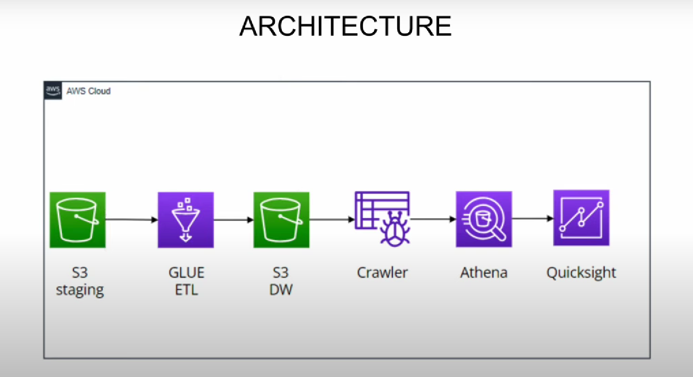
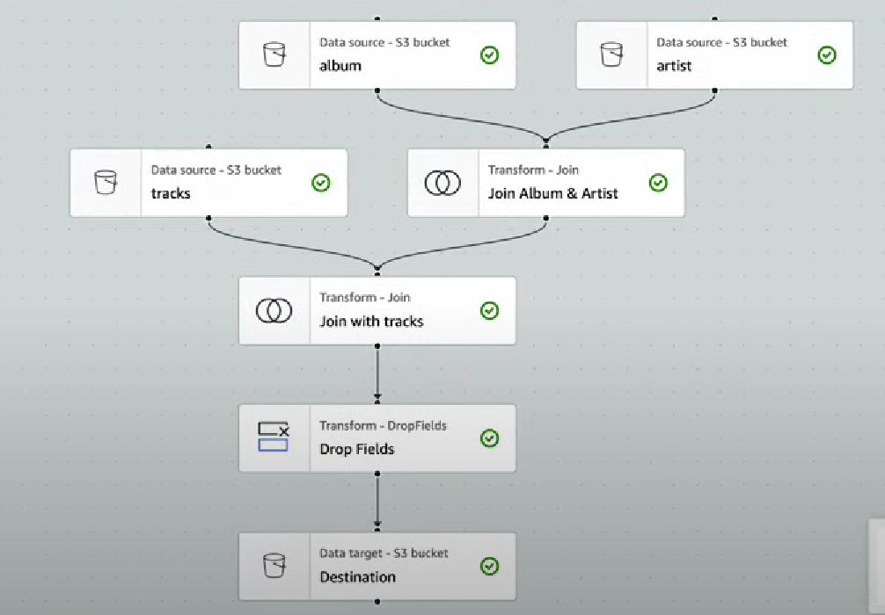

# 📚 Project Overview

This project demonstrates a modern AWS-based Data Engineering pipeline for analyzing Spotify music data.  
The full ETL and visualization flow is built using AWS services including S3, Glue, Athena, and QuickSight.

# 🏗️ Architecture

## Spotify End-to-End Architecture

## AWS Glue Visual ETL Flow

# ⚙️ Workflow

## Data Upload:
- Uploaded 5 CSV files (`album.csv`, `artist.csv`, `tracks.csv`, `spotify_data.csv`, `features.csv`) into an S3 **staging** bucket.

## ETL Transformation using AWS Glue:
- Designed a Visual ETL Job to:
  - Join album and artist data.
  - Join the result with track data.
  - Drop unwanted fields.
  - Save the final transformed data into a **parquet** format inside an S3 **Data Warehouse** bucket.

## Visual ETL Flow:
- Visual ETL designed using Glue Studio (refer diagram above).

## Crawler and Metadata Management:
- Created a **Crawler** to automatically generate the schema from the transformed Parquet files.
- Created a table in **AWS Glue Data Catalog**.

## Query using Athena:
- Queried the curated tables directly using **AWS Athena** (Serverless SQL engine).

## Visualization in QuickSight:
- Connected **QuickSight** with Athena.
- Built interactive dashboards to explore insights like:
  - Top Artists by Track Popularity
  - Track Release Trends
  - Genre and Album Analysis

# 🚀 AWS Services Used

| Service      | Purpose                                      |
|--------------|----------------------------------------------|
| S3           | Staging raw data and storing curated data warehouse |
| AWS Glue     | ETL processing and schema generation        |
| Glue Crawler | Metadata extraction and table creation      |
| Athena       | Serverless querying on S3 Data Lake         |
| QuickSight   | Visualization and Dashboard Creation        |

# 📈 Key Learnings

- Hands-on experience in building an end-to-end serverless data pipeline.
- Understanding Visual ETL development using AWS Glue Studio.
- Working with Athena and QuickSight for low-cost querying and analytics.
- Building curated S3 Data Lakes using Parquet format for optimization.

# 🛠️ Improvements for Future

- Automate ETL job scheduling with AWS Glue Workflows/Triggers.
- Add data quality validation layers before transformation.
- Implement incremental data load and partitioning for cost efficiency.
